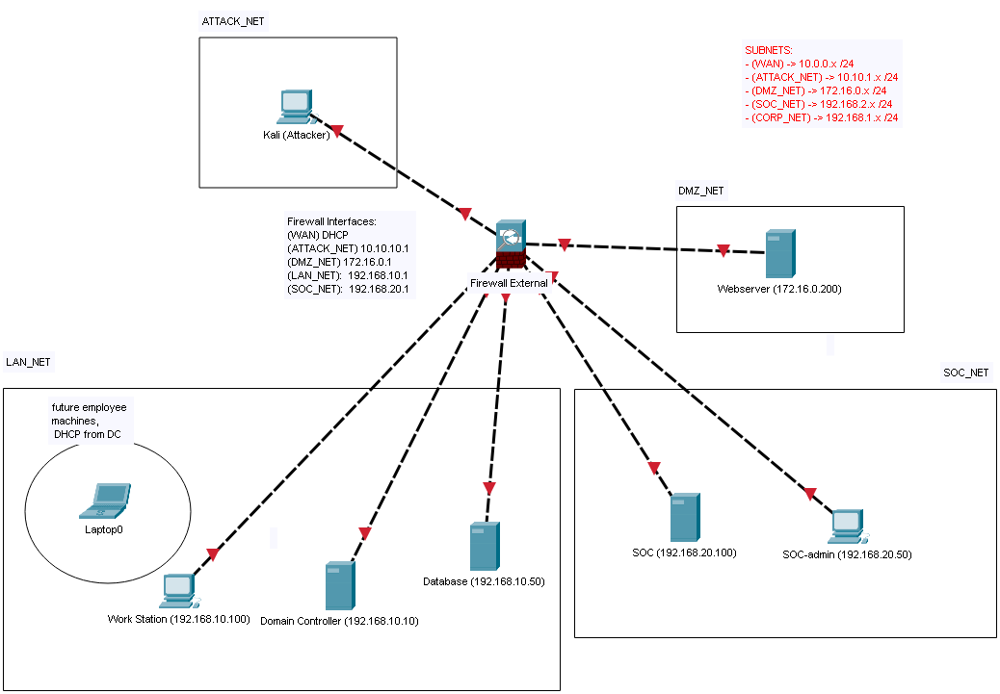

# Homelab-SIEM

A segmented virtual enterprise network built from the ground up for practicing offensive and defensive cybersecurity. The environment simulates a real corporate network with isolated subnets, a centralized firewall, Active Directory, a vulnerable web application, and a SIEM - designed to demonstrate the full lifecycle of an attack from initial exploitation to detection and response.

## Network Architecture

<!-- Network diagram -->

## Project Sections

Below are the various sections of this project. Each covers a different aspect of the environment - from how the network is built, to the attacks performed against it, to the defenses put in place to detect and contain those attacks. Click into each section for a detailed writeup.

- **[Architecture](docs/)** - Network layout, subnet design, machine roles, firewall configuration, and infrastructure setup
- **[Attacks](attacks/)** - Offensive exercises performed against the environment, with step-by-step writeups showing exploitation techniques and attack chains
- **[Defenses](defenses/)** - Detection, monitoring, and containment strategies used to identify and respond to the attacks

## Documentation

| Architecture | Description |
|---|---|
| [Network Architecture](docs/network-architecture.md) | Subnet layout, machine inventory, and key security principles |
| [Firewall Rules](docs/firewall-rules.md) | pfSense rule sets for each subnet with rationale |
| [Database Setup](docs/database-setup.md) | MariaDB installation, DVWA configuration, and remote database architecture |
| [Splunk Setup](docs/splunk-setup.md) | SIEM deployment, forwarder configuration, indexes, and dashboards |
| [Active Directory](docs/active-directory.md) | Domain Controller setup, OUs, GPOs, and domain-joined Linux hosts |
| [SSH Hardening](docs/ssh-hardening.md) | Key-based authentication, bastion host setup, and access controls |

## Attack Writeups

| Writeup | Description |
|---|---|
| [Command Injection → DB Compromise](attacks/command-injection.md) | Full attack chain from DVWA input field to database credential theft and password cracking |
| [SQL Injection](attacks/sql-injection.md) | *Planned* |
| [Brute Force](attacks/brute-force.md) | *Planned* |
| [XSS (Reflected & Stored)](attacks/xss.md) | *Planned* |

## Defense Documentation

| Document | Description |
|---|---|
| [Network Segmentation](defenses/network-segmentation.md) | How subnet isolation and firewall rules contain lateral movement |
| [IDS Monitoring](defenses/ids-monitoring.md) | Intrusion detection configuration and alert tuning |
| [Log Analysis & Alerting](defenses/log-analysis.md) | SPL queries, correlation searches, and Splunk alert dashboards |

## Status

This project is actively being built out. Current priorities:
- Completing DVWA attack modules and writeups
- Active Directory GPO configuration and domain-joining Linux hosts
- Splunk forwarder deployment and dashboard creation
- Tightening SOC_NET firewall rules

---

*Built by Julian Yeshen Blackshaw*