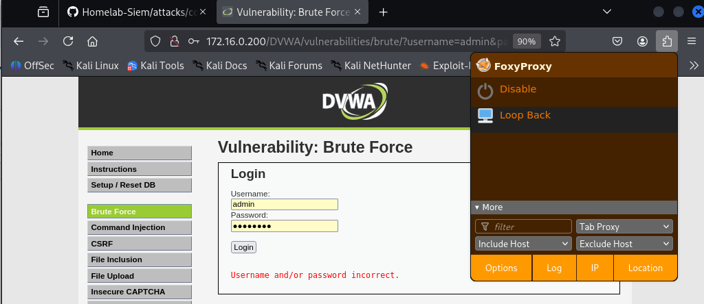
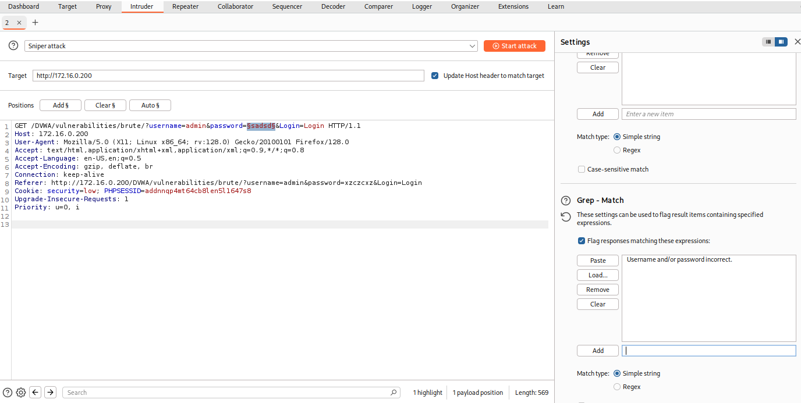
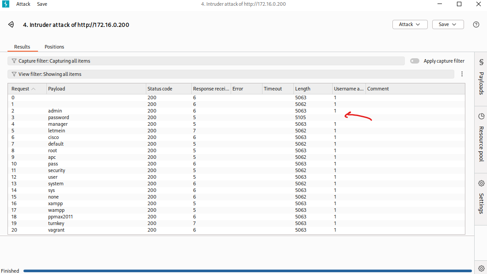
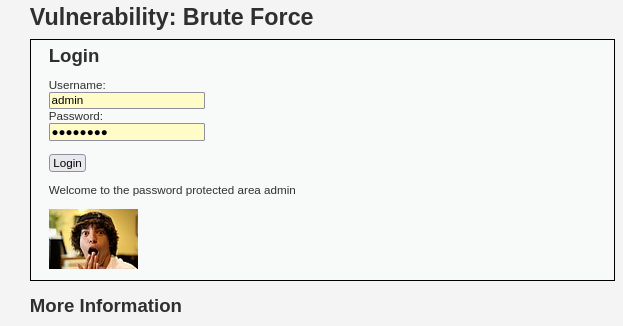

## Brute Force Attack - DVWA

### Overview

DVWA's Brute Force vulnerability module exposes a basic login form with no account lockout or rate limiting, making it trivially susceptible to automated password guessing.

### Attack Process

**1. Intercept the Login Request**

FoxyProxy was configured in the browser to redirect traffic through Burp Suite, allowing the login request to be intercepted.

**2. Send to Intruder**

The intercepted GET request was sent to Burp Suite's Intruder module. The password parameter was marked as the payload position for the attack.

**3. Configure the Attack**

- Attack type: **Sniper**
- Payload: **Simple List** using `http_default_pass.txt` (included with Kali Linux) - a wordlist of common default passwords
- Grep Match: `Username and/or password incorrect.` - used to flag failed attempts, making successful attempts easy to identify by their absence

**4. Run the Attack**

Intruder cycled through the password list, sending one request per password. The password `password` was identified as the valid credential - visible in the results as the entry with a different response length (`5105`) compared to all failed attempts (`~5062-5063`).

**5. Successful Login**

Using the discovered credentials (`admin:password`), login to the Brute Force module was confirmed.

### Note - Hard Difficulty

At Hard difficulty, DVWA implements a CSRF token that changes with every request. This means the password parameter alone is no longer sufficient - each request must include a valid, up-to-date token. A following writeup will be added to this once the exercise is complete.