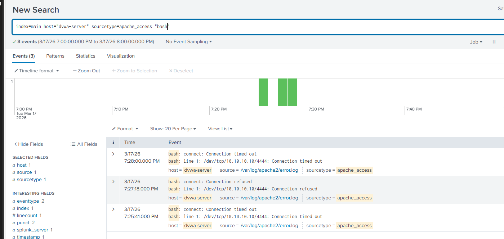
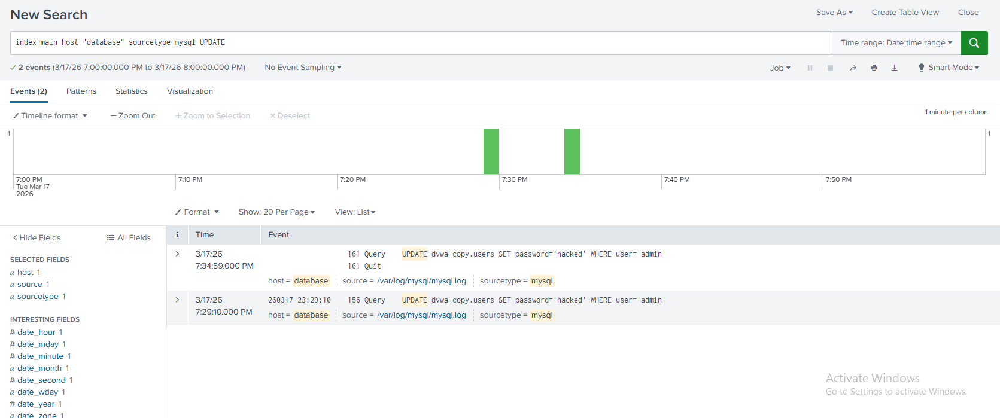
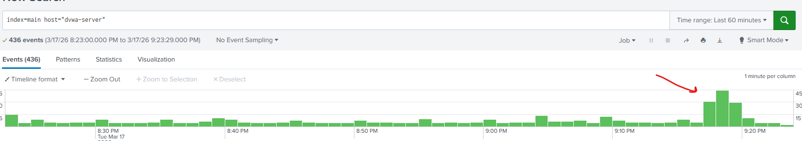
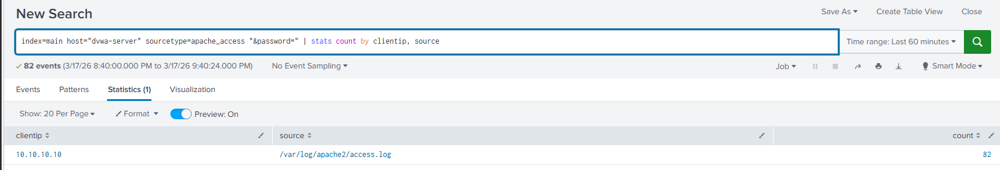
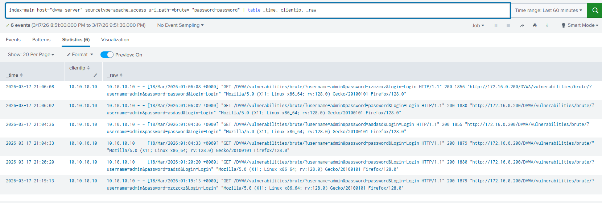

# Attack Detection

Detection and investigation of attacks performed against the lab environment using Splunk queries and log analysis.

## Contents
- [1. Reverse Shell Detection Attempt](#1-reverse-shell-detection-attempt)
- [2. Brute Force Detection - Splunk](#2-brute-force-detection---splunk)

## 1. Reverse Shell Detection Attempt

### Overview

After executing a successful reverse shell from the DVWA command injection vulnerability, an attempt was made to find traces of the attack across available log sources on the DVWA server.

### Investigation

The following sources were searched manually, trying various queries across relevant paths and keywords:

**Auth log:**
```spl
index=main host="dvwa-server" source="/var/log/auth.log"
```
Only returned normal background activity - SSH sessions and recurring cron job PAM session open/close events. No trace of the reverse shell.

**Syslog:**
```spl
index=main host="dvwa-server" sourcetype=syslog
```
No relevant events found related to the attack.

**Apache access log - command injection endpoint:**
```spl
index=main host="dvwa-server" sourcetype=apache_access uri_path="/DVWA/vulnerabilities/exec/"
```
Confirmed requests to the command injection endpoint but no visibility into what commands were actually executed - Apache only logs the HTTP request, not server-side execution.

**Apache error log - bash keyword:**
```spl
index=main host="dvwa-server" sourcetype=apache_access "bash"
```

This was the only source that returned relevant results - failed reverse shell attempts logged in `/var/log/apache2/error.log`:
```
bash: connect: Connection timed out
bash: line 1: /dev/tcp/10.10.10.10/4444: Connection timed out

bash: connect: Connection refused
bash: line 1: /dev/tcp/10.10.10.10/4444: Connection refused
```

These errors appeared because bash tried to connect back to the Kali listener (`10.10.10.10:4444`) but the listener wasn't running at that moment.

Notably, the **successful** reverse shell left no trace here - a successful connection produces no error output, so nothing gets written to the error log.



**MySQL log - credential tampering:**
```spl
index=main host="database" sourcetype=mysql UPDATE
```

The MySQL general query log captured the credential modification performed during the attack:
```
UPDATE dvwa_copy.users SET password='hacked' WHERE user='admin'
```

This confirms that database query logging is an effective detection layer for post-exploitation activity even when command execution is invisible.



### Why the Reverse Shell Was Not Detected

The standard Linux log sources available (auth.log, syslog, Apache access log) are each scoped to specific activity - authentication events, system messages, and HTTP requests respectively. None of them capture commands executed by the web server process itself, which is how the reverse shell ran.
The Apache error log was the only source that showed any trace, and only because the connection failed - a successful reverse shell produces no error output and leaves nothing behind in these logs.

### Conclusion

Basic Linux logging doesn't capture everything. To properly detect reverse shell activity, a dedicated process monitoring tool like auditd or Sysmon for Linux would need to be installed on the DVWA server - these tools are specifically designed to track process execution at a lower level than standard system logs.

---

## 2. Brute Force Detection - Splunk

### Overview

The brute force attack was detected through a combination of traffic volume analysis and targeted queries against Apache access logs.

### Detection Process

**1. Traffic Spike**

A broad query across all DVWA logs revealed a noticeable spike in event volume during the attack window - a significant increase in requests compared to the baseline activity.
```spl
index=main host="dvwa-server"
```



**2. Identifying the Source**

Filtering on the `&password=` parameter (present in every brute force request to the login endpoint) and grouping by source IP revealed 82 requests all originating from `10.10.10.10` (Kali) within a short time window - a clear indicator of automated activity.
```spl
index=main host="dvwa-server" sourcetype=apache_access "&password=" | stats count by clientip, source
```



**3. Confirming Successful Logins**

Since the password was known, a targeted query for requests containing `password=password` against the brute force endpoint confirmed that the correct credentials appeared in the URI - identifying the requests where the attack succeeded.
```spl
index=main host="dvwa-server" sourcetype=apache_access uri_path=*brute* "password=password" | table _time, clientip, _raw
```



### Key Observations

- 82 rapid requests from a single IP to the same endpoint is a strong brute force indicator
- The credentials were passed in the URL as GET parameters rather than a POST body - meaning the password is visible in plain text in the Apache access log, making detection straightforward
- In a real environment with no prior knowledge of the password, the successful request could still be identified by its different response length compared to all failed attempts - as observed in Burp Suite during the attack

### Planned:
- all other attacks. XSS, DDos etc.