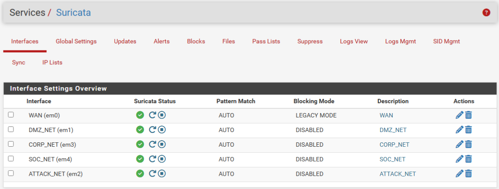
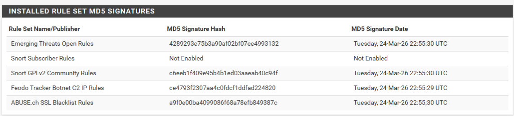
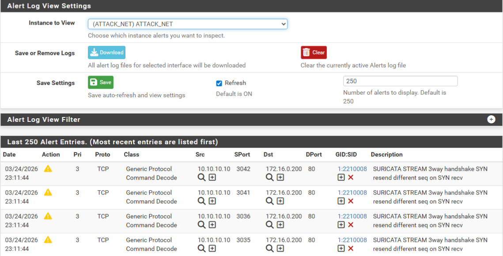
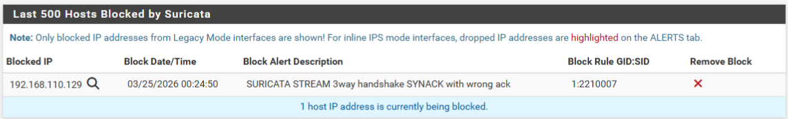
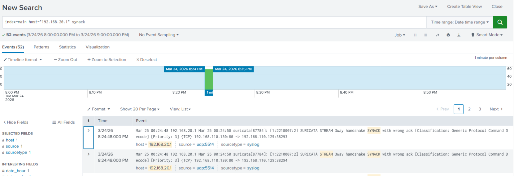

# IPS / IDS - Suricata on pfSense

Suricata was installed on pfSense as the network-level intrusion detection and prevention system. It monitors traffic on every interface, analysing packets against signature-based rule sets to detect and block malicious activity.

## Interface Configuration

Suricata runs on all five network interfaces. The WAN interface operates in **IPS mode** (Legacy Mode blocking enabled) to actively block malicious inbound traffic. All internal interfaces run in **IDS mode** (blocking disabled) to monitor and alert without disrupting traffic - this is intentional so attacks on internal subnets can be observed and analysed rather than silently dropped, aswell as to allow standard employee internet traffic.

| Interface | Mode | Blocking | Rationale |
|---|---|---|---|
| WAN (em0) | IPS | Legacy Mode | Block inbound threats before they reach the network |
| DMZ_NET (em1) | IDS | Disabled | Observe attack traffic to DVWA for detection exercises |
| CORP_NET (em3) | IDS | Disabled | Monitor internal traffic without disruption |
| SOC_NET (em4) | IDS | Disabled | Monitor SOC network activity |
| ATTACK_NET (em2) | IDS | Disabled | Observe simulated attacker traffic |

All interfaces have **Send Alerts to System Log** and **HTTP Log** enabled.



## Installed Rule Sets

The following rule sets are enabled across all interfaces:



| Rule Set | Purpose |
|---|---|
| Emerging Threats Open Rules | Community-maintained signatures covering malware, exploits, policy violations, and protocol anomalies |
| Snort GPLv2 Community Rules | Core detection signatures from Snort's open rule set |
| Feodo Tracker Botnet C2 IP Rules | Known command-and-control server IPs associated with banking trojans |
| ABUSE.ch SSL Blacklist Rules | SSL certificates associated with malware and botnet activity |

## DDoS Detection Exercise

### Internal (ATTACK_NET to DVWA)

A SYN flood was launched from the Kali attacker against the DVWA webserver:

```bash
hping3 -S --flood -V -p 80 172.16.0.200
```

Suricata detected the flood and generated alerts on the ATTACK_NET interface. Since this interface runs in IDS mode, the traffic was logged but not blocked.



### External (WAN)

The same SYN flood was run against the WAN IP to simulate an external DDoS:

```bash
hping3 -S --flood -V -p 80 192.168.110.130
```

Suricata detected the attack and **actively blocked** the source IP because the WAN interface runs in IPS mode with Legacy Mode blocking enabled. The blocked host appears in Suricata's block list.



Suricata's alerts were also forwarded to Splunk, confirming the DDoS activity is visible in the SIEM for correlation and alerting.



## Sections to Cover
- Alert tuning and suppression lists
- Additional attack detection examples
