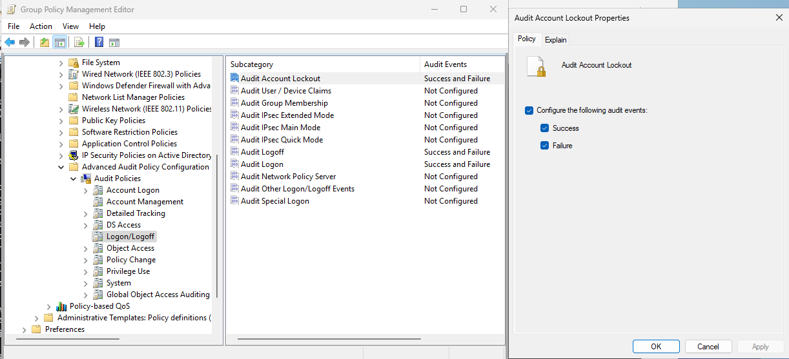
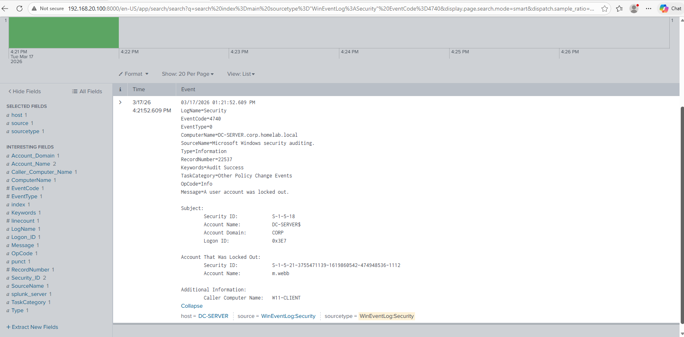
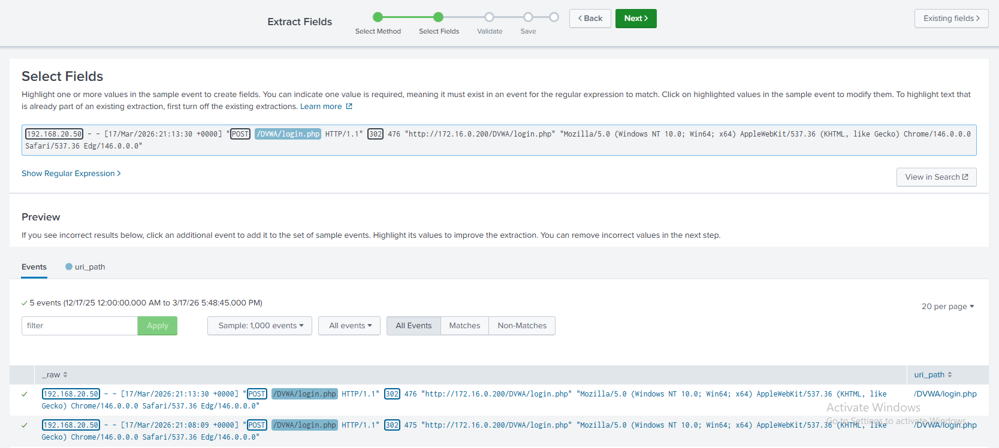
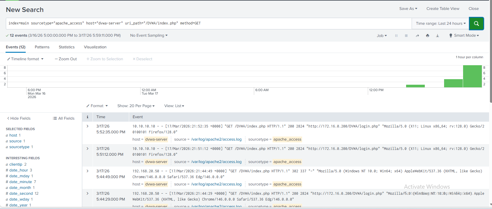

# Log Analysis & Alerting

> **Documentation In Progress**

Documentation of Splunk SPL queries, correlation searches, and alert dashboards used to detect attacks performed in the lab.

## 1. Account Lockout Detection

### Audit Policy Configuration

By default, Windows does not log many of the events needed for security monitoring. Advanced audit policies were enabled on the Domain Controller so that key events like account lockouts (Event ID 4740) are actually generated and forwarded to Splunk.

The following audit categories were enabled (Success and Failure):

| Category | Subcategory | Purpose |
|---|---|---|
| Account Management | All | Tracks user/group creation, deletion, modifications, and lockouts (4740) |
| Account Logon | Credential Validation | Tracks credential validation against the DC (4776) |
| Logon/Logoff | Logon, Logoff, Account Lockout | Tracks failed logon attempts (4625), successful logons (4624), and lockouts |
| Detailed Tracking | Process Creation | Tracks every process spawn (4688) - critical for detecting malware execution |
| Policy Change | Audit Policy Change | Detects if an attacker modifies or disables audit policies to cover their tracks |
| Privilege Use | Sensitive Privilege Use | Tracks use of sensitive privileges like SeDebugPrivilege, commonly abused by tools like Mimikatz |



### SPL Query

To test querying, the domain account `m.webb` was intentionally locked out by entering incorrect passwords on the W11-Client workstation.


With the audit policies in place, the following SPL query searches Windows Security event logs for account lockout events:

```spl
index=main sourcetype="WinEventLog:Security" EventCode=4740
```

This filters for Event ID 4740 (account lockout). In a production environment this would be paired with a Splunk alert set to trigger on a short interval (e.g. every 5 minutes) to enable near-real-time detection.

### Result

The query returned a lockout event for the user `m.webb`, confirming that the audit policies, log forwarding, and Splunk query are all working end to end.



## 2. DVWA Successful Login Events

### SPL Query
```spl
index=main sourcetype=apache_access host="dvwa-server" uri_path="/DVWA/index.php" method="GET"
```

After a successful login, DVWA redirects the user to `/DVWA/index.php`. Querying for `GET` requests to this endpoint is a reliable indicator of successful authentication, since this page is only reached after valid credentials are submitted. This approach is more precise than filtering on status codes alone, which can vary depending on the client browser or tool used.

### Field Extractions

Fields such as `clientip`, `status`, `method`, and `uri_path` are not automatically extracted from Apache access logs in Splunk. An equivalent query without extracted fields might look like:

```spl
index=main sourcetype=apache_access host="dvwa-server" "/DVWA/index.php" "GET"
```

Custom field extractions were created via the Field Extractor wizard (**Settings → Fields → Field Extractions**) by highlighting values in a sample event and naming them according to Splunk CIM conventions.



### Result

The query returned successful login events to DVWA, showing the source IPs and timestamps of each authenticated session. This is useful for identifying who is accessing the application and from where — in particular, logins from unexpected IPs such as the Kali attacker at `10.10.10.10`.



Note: Apache access logs only provide HTTP metadata. In production environments, dedicated auth logging via the application, an identity provider would provide more reliable login visibility.


## 3. Reverse Shell Detection Attempt

### Overview

After executing a successful reverse shell from the DVWA command injection vulnerability, an attempt was made to find traces of the attack across available log sources on the DVWA server.

### Investigation

The following sources were searched manually, trying various queries across relevant paths and keywords:

**Auth log:**
```spl
index=main host="dvwa-server" source="/var/log/auth.log"
```
Only returned normal background activity - SSH sessions and recurring cron job PAM session open/close events. No trace of the reverse shell.

**Syslog:**
```spl
index=main host="dvwa-server" sourcetype=syslog
```
No relevant events found related to the attack.

**Apache access log - command injection endpoint:**
```spl
index=main host="dvwa-server" sourcetype=apache_access uri_path="/DVWA/vulnerabilities/exec/"
```
Confirmed requests to the command injection endpoint but no visibility into what commands were actually executed - Apache only logs the HTTP request, not server-side execution.

**Apache error log - bash keyword:**
```spl
index=main host="dvwa-server" sourcetype=apache_access "bash"
```

This was the only source that returned relevant results - failed reverse shell attempts logged in `/var/log/apache2/error.log`:
```
bash: connect: Connection timed out
bash: line 1: /dev/tcp/10.10.10.10/4444: Connection timed out

bash: connect: Connection refused
bash: line 1: /dev/tcp/10.10.10.10/4444: Connection refused
```

These errors appeared because bash tried to connect back to the Kali listener (`10.10.10.10:4444`) but the listener wasn't running at that moment. The stderr output from the failed connection was captured by Apache's error log since the command executed in the context of the Apache/PHP process.

Notably, the **successful** reverse shell left no trace here - a successful connection produces no error output, so nothing gets written to the error log.


**MySQL log - credential tampering:**
```spl
index=main host="database" sourcetype=mysql UPDATE
```

The MySQL general query log captured the credential modification performed during the attack:
```
UPDATE dvwa_copy.users SET password='hacked' WHERE user='admin'
```

This confirms that database query logging is an effective detection layer for post-exploitation activity even when command execution is invisible.


### Why the Reverse Shell Was Not Detected

TThe standard Linux log sources available (auth.log, syslog, Apache access log) are each scoped to specific activity - authentication events, system messages, and HTTP requests respectively. None of them capture commands executed by the web server process itself, which is how the reverse shell ran.
The Apache error log was the only source that showed any trace, and only because the connection failed - a successful reverse shell produces no error output and leaves nothing behind in these logs.

### Conclusion

Basic Linux logging doesn't capture everything. To properly detect reverse shell activity, a dedicated process monitoring tool like auditd or Sysmon for Linux would need to be installed on the DVWA server - these tools are specifically designed to track process execution at a lower level than standard system logs.

## Sections to Cover
- SPL queries for detecting brute force, command injection, and lateral movement
- Correlation searches linking events across endpoints
- Alert dashboard configuration and thresholds
- Example alerts triggered by attack exercises
- Wireshark Packet Analysis?
