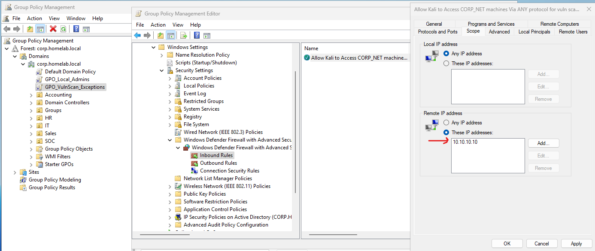
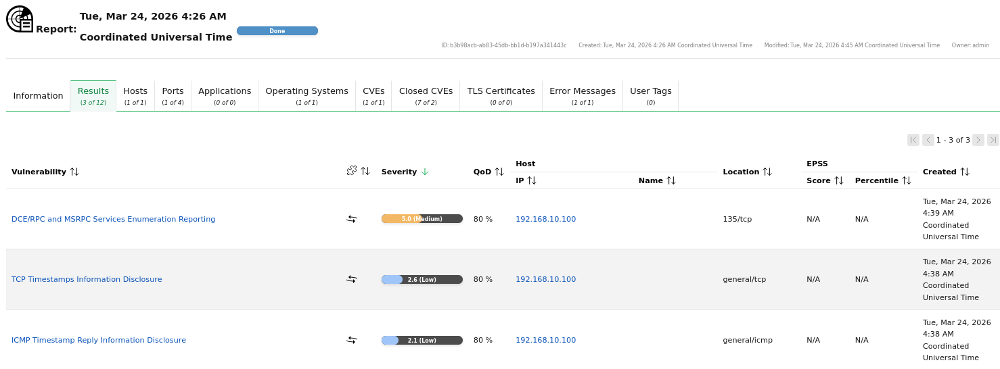

# Vulnerability Scanning - OpenVAS

> **Documentation In Progress**

Documentation of vulnerability scanning across the lab environment using OpenVAS (Greenbone Vulnerability Management).

## Firewall Configuration

Firewall rules were added to allow the scanner to reach targets across DVWA and CORP_NET.

## Scan Targets

1. DVWA (172.16.0.200)
2. Domain Controller (192.168.10.10)
3. Workstation (W11-Client)

## Domain Controller

Scan: 70 QoD

## Workstation

Created a GPO because by default, domain endpoint (Windows) firewalls block actions like ICMP, RDP, and most important ports the scanner tests.

Scan: 70 QoD

### Result

## Sections to Cover
- Scan results and findings
- Remediation steps taken
