# Active Directory - Domain Controller, DHCP & IAM Configuration

## Overview

This document covers the setup of a centralized identity and access management system for the homelab's corporate network (CORP_NET). A Windows Server was promoted to a Domain Controller running Active Directory Domain Services, DNS, and DHCP. A Windows 11 Enterprise workstation was joined to the domain, and role-based access controls were implemented through Organizational Units, Security Groups, and Group Policy Objects to enforce least-privilege access across the environment.

## Domain Controller Setup

**Server:** DC-SERVER (192.168.10.10) - Windows Server on CORP_NET

The server was configured with a static IP, with DNS pointing to itself (127.0.0.1) since AD requires its own DNS service to function.

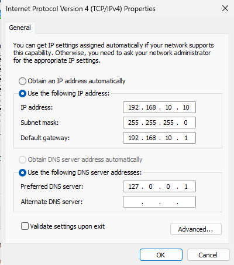

Active Directory Domain Services was installed via Server Manager → Add Roles and Features. The server was then promoted to a Domain Controller, creating a new forest with the root domain `corp.homelab.local`.

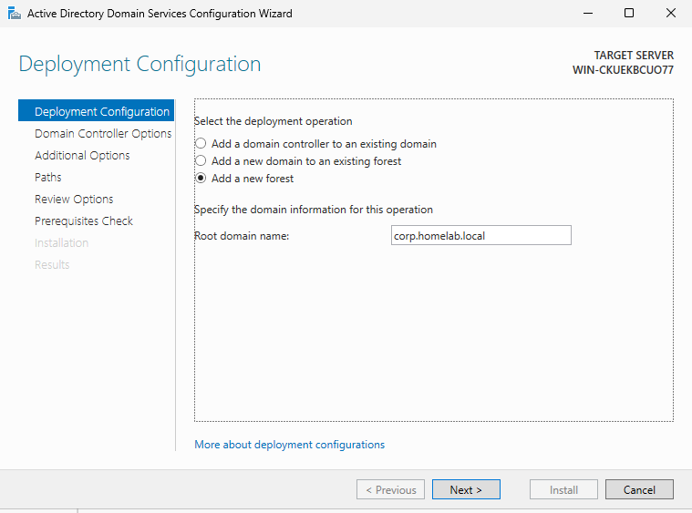

### DNS Configuration

AD installs its own DNS server during promotion, which handles internal name resolution for the domain. Domain-joined machines use the DC as their DNS server so they can locate AD services (Kerberos, LDAP, etc.) via SRV records.

For external queries (e.g., google.com), a DNS forwarder was added pointing to pfSense (192.168.10.1). The DC resolves internal domain names locally and forwards everything else to pfSense, which resolves it through the home router.

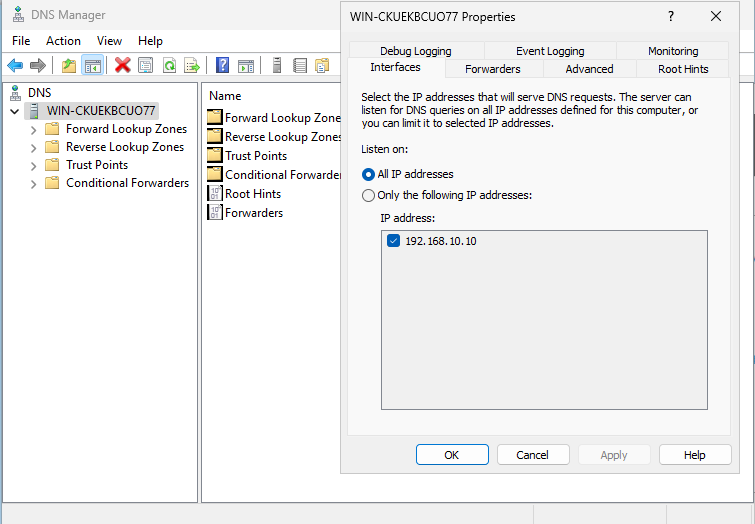

### DHCP Configuration

DHCP was installed on the DC and authorized in Active Directory. A scope was created to dynamically assign IP addresses to CORP_NET clients:

- **Scope range:** 192.168.10.100 - 192.168.10.200
- **Subnet mask:** 255.255.255.0
- **Default gateway:** 192.168.10.1 (pfSense)
- **DNS server:** 192.168.10.10 (DC)
- **Domain name:** corp.homelab.local
- **Lease duration:** 8 days

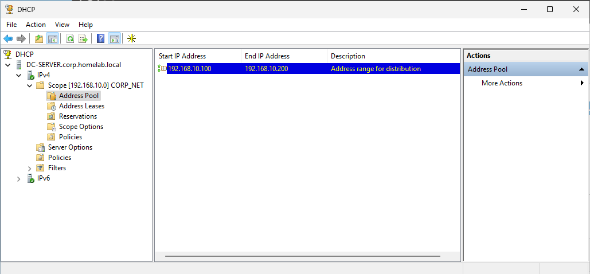

## Workstation Domain Join

A Windows 11 Enterprise Evaluation VM was deployed as the corporate workstation (W11-CLIENT). Windows Home edition cannot join a domain, so Enterprise was required.

The workstation was set to obtain its IP via DHCP. After verifying it received the correct configuration from the DC, it was joined to `corp.homelab.local` through System Properties.

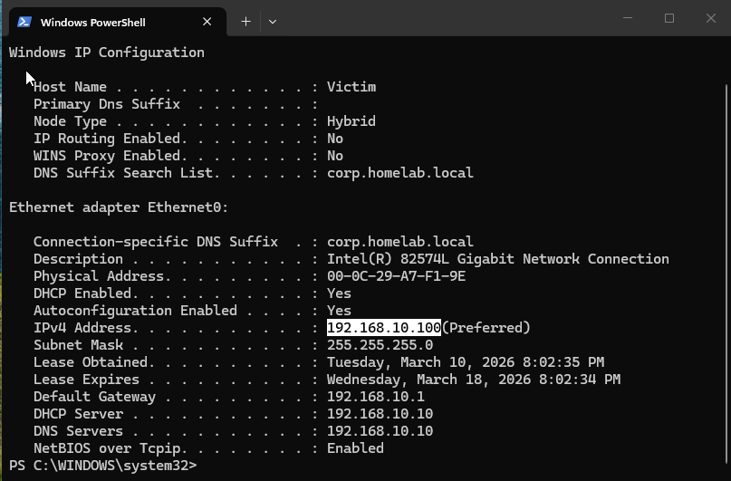

## Organizational Units

The following OUs were created to mirror a realistic corporate department structure:

- **IT** - system administrators, helpdesk, IT management
- **HR** - human resources staff
- **Sales** - sales team
- **SOC** - security operations analysts
- **Accounting** - finance and accounting staff
- **Groups** - contains all security groups, organized into sub-OUs by department (IT Groups, HR Groups, SOC Groups, Sales Groups, Accounting Groups)

Groups were placed in a dedicated OU to keep them separate from user objects, preventing GPOs linked to department OUs from unintentionally affecting group objects.

## Security Groups & Users

User accounts follow a `first.last` naming convention. Each user is assigned to a security group matching their role, which determines their level of access across the domain.

**IT Department Groups:**

| Security Group | Role | Members | Permissions |
|---|---|---|---|
| SG_IT_Managers | Full admin access | Julian Blackshaw | Local admin, GPO edit rights, RDP to all servers |
| SG_Sysadmins | Infrastructure access | Priya Patel | Local admin on workstations, RDP to servers |
| SG_HelpDesk | Limited support | Marcus Webb | Password resets, account unlocks only |

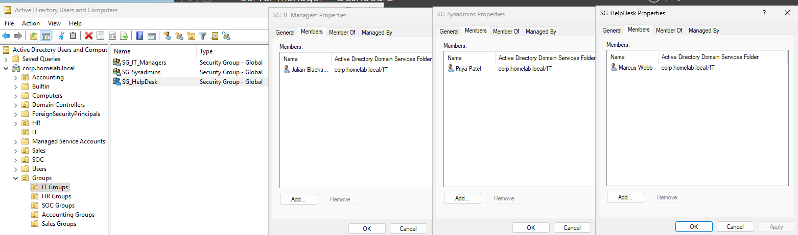

Additional users were created across HR, Sales, SOC, and Accounting OUs with corresponding security groups.

### Logon Hour Restrictions

Logon hours were configured for Accounting users (Tom Bradey, Lamar Jackson), restricting access to business hours only (Mon-Fri, 8 AM-8 PM). This is a common control in environments handling financial data.

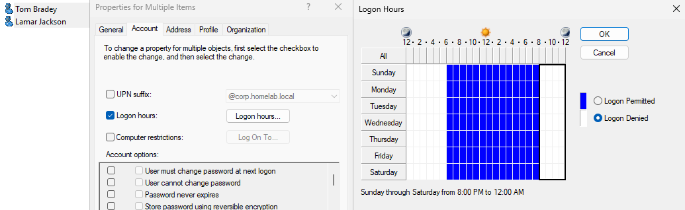

## Group Policy Objects

### GPO_Local_Admins (linked to domain)
 
Every Windows machine has a built-in local Administrators group that grants full control over that machine. By default, AD doesn't enforce who belongs to this group - any existing admin can add other users, and nothing reverts it. Without Restricted Groups, local admin membership can drift over time with no oversight.
 
The Restricted Groups policy solves this by defining exactly who is allowed in the local Administrators group on every domain-joined workstation. Every time Group Policy refreshes (every 90 minutes, or on `gpupdate /force`), Windows checks the local Administrators group and enforces the defined list. If someone manually adds an unauthorized user to local admins, the next policy refresh removes them automatically.
 
The GPO_Local_Admins policy permits only the following groups:
 
- Domain Admins
- SG_IT_Managers
- SG_Sysadmins
 
All other users - including HelpDesk - are excluded. This enforces least-privilege by ensuring standard employees and support staff cannot install software, modify system settings, or make administrative changes - even if they have physical access to the workstation.
 
Restricted Groups can also be used to control membership of other local groups such as Remote Desktop Users (who can RDP in), Backup Operators, and Event Log Readers.

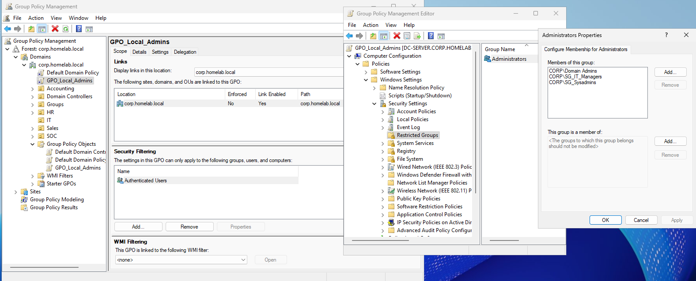

### Password Policy (Default Domain Policy)

- Minimum password length: 12 characters
- Complexity requirements: Enabled
- Maximum password age: 90 days

### Account Lockout Policy (Default Domain Policy)

- Lockout threshold: 5 failed attempts
- Lockout duration: 15 minutes
- Reset counter after: 15 minutes

### Audit Policy (Default Domain Policy)

Advanced audit policies enabled for:

- Logon/Logoff events (Success + Failure)
- Account Logon events (Success + Failure)
- Object Access (Failure)
- Privilege Use (Failure)

These events generate Windows Security logs that will be forwarded to Splunk for centralized monitoring and alerting.

## Verification - Least-Privilege in Action

To validate the access controls, identical tasks were performed on the W11-CLIENT workstation from two different accounts.

### HelpDesk User (Marcus Webb - SG_HelpDesk)

Attempting to add a local user via PowerShell returned "Access is denied." Attempting to open an elevated PowerShell prompted for admin credentials, which the HelpDesk account does not have.

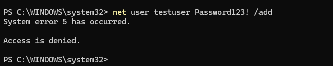

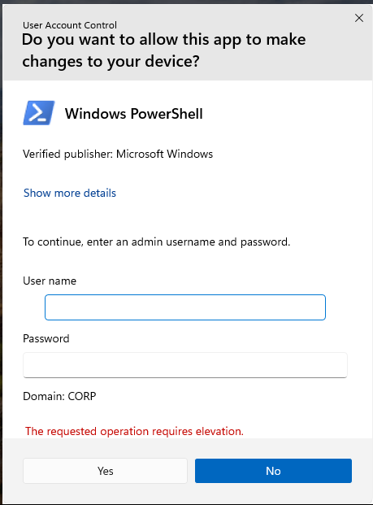

### IT Manager (Julian Blackshaw - SG_IT_Managers)

The same commands executed successfully - the account has local admin rights through the GPO_Local_Admins Restricted Groups policy. Users were created and deleted without issue.

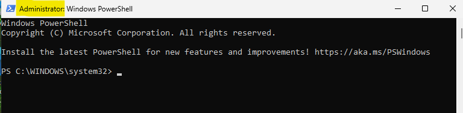

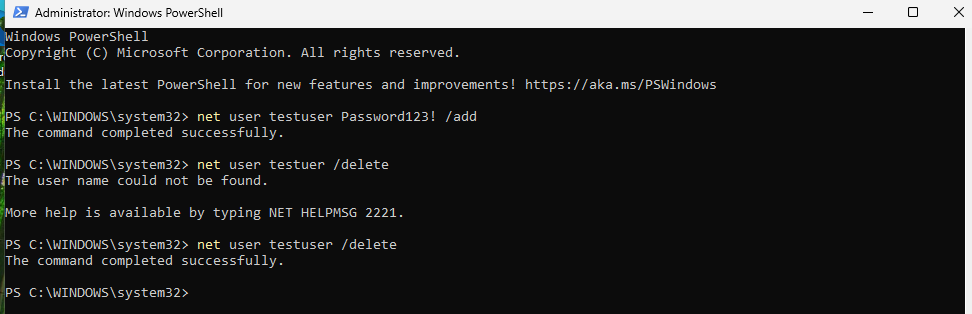

## Key Takeaways
 
- **Active Directory centralizes identity management.** All authentication flows through the DC - users log in with domain credentials, and the DC enforces policies across every joined machine.
- **OUs organize objects and apply policies.** GPOs linked to an OU affect every user and computer within it, making department-level policy management straightforward.
- **Security Groups control resource access.** Group membership determines what a user can and cannot do, enabling role-based access control without configuring permissions per user.
- **Least-privilege is enforced through GPOs.** The Restricted Groups policy ensures only authorized roles have admin rights - a HelpDesk user with physical access to a workstation still cannot escalate privileges.
- **Audit logging enables detection.** The audit policy generates security events for every logon attempt, privilege use, and access failure - providing the telemetry needed for SIEM monitoring and threat detection.
 
## TODO
 
### Access Control Layers to Implement
 
The current configuration enforces least-privilege at the local admin level through Restricted Groups. The following additional layers will be implemented to create a more complete access control model:
 
- **Restricted Groups (GPO)** - *Implemented.* Controls who has admin rights on machines. Future: extend to control Remote Desktop Users group membership.
- **NTFS / Share Permissions** - Create department-scoped shared folders (e.g., `\\DC-SERVER\HR_Documents`, `\\DC-SERVER\Accounting_Files`) with access restricted to the corresponding security groups.
- **GPO Workstation Restrictions** - Configure per-department GPOs to restrict Control Panel access, block USB drives, limit application execution via AppLocker, and map department-specific network drives.
- **Application Permissions** - Integrate application-level access with AD security groups so applications authenticate against AD and check group membership before granting access.
- **AD Delegation** - Delegate password reset and account unlock permissions to SG_HelpDesk on Standard Users OU, scoping their authority to only the users they support.
 
### Additional Tasks
 
- Configure RDP access GPO limiting remote desktop to IT groups only
- Join Linux hosts to the domain via realmd + SSSD
- Install Splunk Universal Forwarder on DC and W11-CLIENT
- Forward Windows Security logs to Splunk and build detection dashboards for failed logons, account lockouts, and privilege escalation attempts