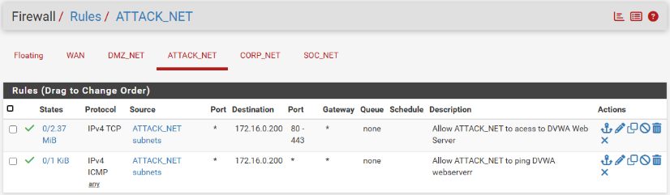
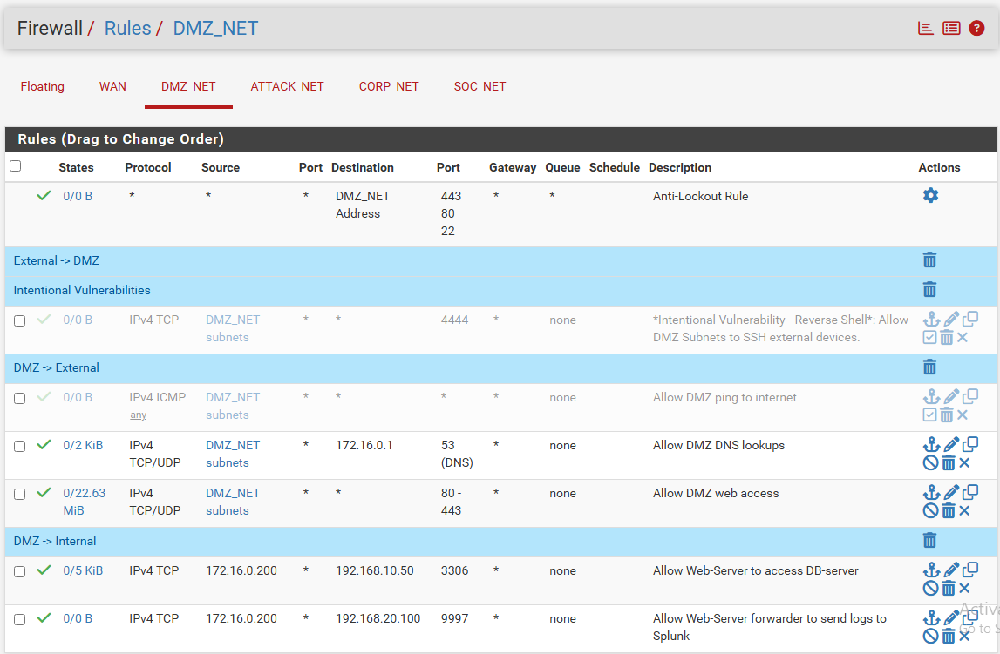
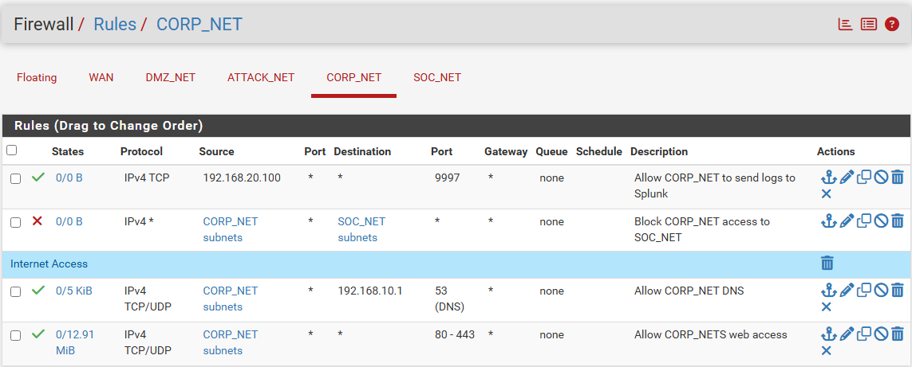
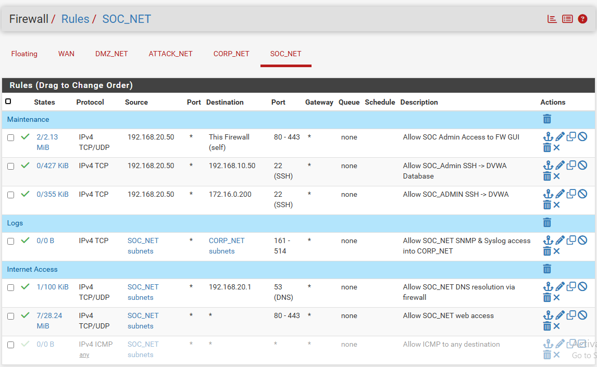

# Firewall Rules (pfSense)

All traffic between subnets is routed through a central pfSense firewall. The firewall enforces a default-deny policy - traffic is blocked unless an explicit rule allows it. Rules are evaluated top-down on each interface, and the first match wins.

Each subnet interface has its own rule set scoped to the traffic that should be allowed to leave that network. The sections below document every rule on each interface, what it permits, and why.

---

## ATTACK_NET (10.10.10.0/24)

This subnet simulates an external attacker network. Rules are kept minimal - the attacker can only reach the DVWA webserver in the DMZ, nothing else.

| # | Protocol | Source | Destination | Port | Description |
|---|---|---|---|---|---|
| 1 | TCP | ATTACK_NET subnets | 172.16.0.200 | 80, 443 | Allow ATTACK_NET to access DVWA Web Server |
| 2 | ICMP | ATTACK_NET subnets | 172.16.0.200 | * | Allow ATTACK_NET to ping DVWA webserver |

**Rationale:**
- Only HTTP/HTTPS and ICMP are permitted, and only to the webserver's IP. The attacker cannot reach CORP_NET, SOC_NET, or any other host in the DMZ.
- This mirrors a real-world scenario where an external attacker can only interact with public-facing services.

---

## DMZ_NET (172.16.0.0/24)

The DMZ hosts the DVWA webserver. Rules here control what the webserver can reach both externally and internally. This is the most detailed rule set because the DMZ sits between the external attacker and the internal network.

### Anti-Lockout Rule

| # | Protocol | Source | Destination | Port | Description |
|---|---|---|---|---|---|
| 1 | * | * | DMZ_NET Address | 443, 80, 22 | Anti-Lockout Rule |

Built-in pfSense rule to prevent locking yourself out of the firewall management interface.

### Intentional Vulnerabilities (External -> DMZ)

| # | Protocol | Source | Destination | Port | Description |
|---|---|---|---|---|---|
| 2 | TCP | DMZ_NET subnets | * | 4444 | *Intentional Vulnerability - Reverse Shell*: Allow DMZ subnets to SSH external devices |

This rule was added temporarily to allow the reverse shell connection during the [Command Injection](../attacks/command-injection.md) attack exercise. In a production environment, this rule would not exist - it is labeled clearly as an intentional vulnerability for testing purposes.

### DMZ -> External

| # | Protocol | Source | Destination | Port | Description |
|---|---|---|---|---|---|
| 3 | ICMP | DMZ_NET subnets | * | * | Allow DMZ ping to internet |
| 4 | TCP/UDP | DMZ_NET subnets | 172.16.0.1 | 53 (DNS) | Allow DMZ DNS lookups |
| 5 | TCP/UDP | DMZ_NET subnets | * | 80, 443 | Allow DMZ web access |

**Rationale:**
- The webserver needs DNS resolution, package updates (HTTP/HTTPS), and ICMP for basic connectivity testing.
- DNS is scoped to the pfSense gateway (172.16.0.1) to prevent DNS queries from reaching external resolvers directly. This blocks DNS tunneling and gives pfSense visibility into all lookups.
- HTTP/HTTPS destinations remain open (`*`) since package repositories are hosted across many external servers.

### DMZ -> Internal

| # | Protocol | Source | Destination | Port | Description |
|---|---|---|---|---|---|
| 6 | TCP | 172.16.0.200 | 192.168.10.50 | 3306 | Allow Web-Server to access DB-Server |
| 7 | TCP | 172.16.0.200 | 192.168.20.100 | 9997 | Allow Web-Server forwarder to send logs to Splunk |

**Rationale:**
- The webserver connects to MariaDB on CORP_NET over port 3306 only - no other ports or hosts on the corporate network are reachable from the DMZ.
- The Splunk Universal Forwarder on the webserver sends logs to the Splunk server on SOC_NET over port 9997.
- Both rules are scoped to the specific source and destination IPs, not the entire subnet.

---

## CORP_NET (192.168.10.0/24)

The corporate network contains the Domain Controller, the database server, and domain-joined workstations.

| # | Protocol | Source | Destination | Port | Description |
|---|---|---|---|---|---|
| 1 | (Block) | CORP_NET subnets | SOC_NET subnets | * | Block CORP_NET access to SOC_NET |
| 2 | TCP | CORP_NET subnets | 192.168.20.100 | 9997 | Allow CORP_NET to send logs to Splunk |
| 3 | TCP/UDP | CORP_NET subnets | 192.168.10.1 | 53 (DNS) | Allow CORP_NET DNS |
| 4 | TCP/UDP | CORP_NET subnets | * | 80, 443 | Allow CORP_NET web access |

**Rationale:**
- The explicit block on SOC_NET is placed first so that corporate machines cannot reach the SIEM or SOC analyst workstation. If CORP_NET is compromised, the attacker cannot tamper with logs or pivot into the security operations network.
- The Splunk log forwarding rule (port 9997) is placed immediately after the SOC_NET block. Since pfSense evaluates rules top-down, this allows CORP_NET hosts to send logs to the Splunk server specifically, while the block rule above still prevents access to every other host on SOC_NET.
- DNS is scoped to the pfSense gateway (192.168.10.1) to prevent direct queries to external resolvers.
- Outbound web access is restricted to HTTP/HTTPS (80/443) only, covering package updates and name resolution while blocking all other outbound protocols.

---

## SOC_NET (192.168.20.0/24)

The security operations network hosts the Splunk SIEM server and the SOC analyst workstation. The SOC-Admin machine acts as the bastion host for managing the entire environment.

### Maintenance

| # | Protocol | Source | Destination | Port | Description |
|---|---|---|---|---|---|
| 1 | TCP/UDP | 192.168.20.50 | This Firewall (self) | 80, 443 | Allow SOC Admin access to FW GUI |
| 2 | TCP | 192.168.20.50 | 192.168.10.50 | 22 (SSH) | Allow SOC_Admin SSH -> DB-Server |
| 3 | TCP | 192.168.20.50 | 172.16.0.200 | 22 (SSH) | Allow SOC_Admin SSH -> DVWA Web-Server |

### Logs

| # | Protocol | Source | Destination | Port | Description |
|---|---|---|---|---|---|
| 4 | TCP | SOC_NET subnets | CORP_NET subnets | 161-514 | Allow SOC_NET SNMP & Syslog access into CORP_NET |

### Internet Access

| # | Protocol | Source | Destination | Port | Description |
|---|---|---|---|---|---|
| 5 | TCP/UDP | SOC_NET subnets | 192.168.20.1 | 53 (DNS) | Allow SOC_NET DNS resolution via firewall |
| 6 | TCP/UDP | SOC_NET subnets | * | 80, 443 | Allow SOC_NET web access |
| 7 | ICMP | SOC_NET subnets | * | * | Allow ICMP to any destination |

**Rationale:**
- The SOC-Admin workstation (192.168.20.50) is the only machine that can access the pfSense web GUI for firewall management.
- SSH access is scoped to the SOC-Admin machine only, and limited to the DB-Server and DVWA Web-Server by IP. All remote management flows through SOC-Admin as a bastion host.
- SNMP/Syslog ports (161-514) allow the SOC network to pull monitoring data from corporate hosts.
- DNS is scoped to the pfSense gateway (192.168.20.1) to match the centralized DNS resolution policy across all subnets.
- Web access (80/443) covers package updates and Splunk management. ICMP is permitted for network troubleshooting from the SOC.

---

## Default-Deny Policy

Any traffic that does not match a rule on its interface is silently dropped by pfSense. This means:

- ATTACK_NET cannot reach CORP_NET or SOC_NET
- DMZ_NET cannot reach CORP_NET except the database on port 3306
- CORP_NET cannot reach SOC_NET except the Splunk server on port 9997 for log forwarding
- No subnet can reach another subnet's hosts unless explicitly permitted

## Planned Changes

- Remove the intentional vulnerability rule (port 4444) on DMZ_NET after attack exercises are complete
- Add rate limiting on ATTACK_NET rules to simulate more realistic external access controls
