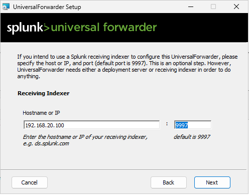
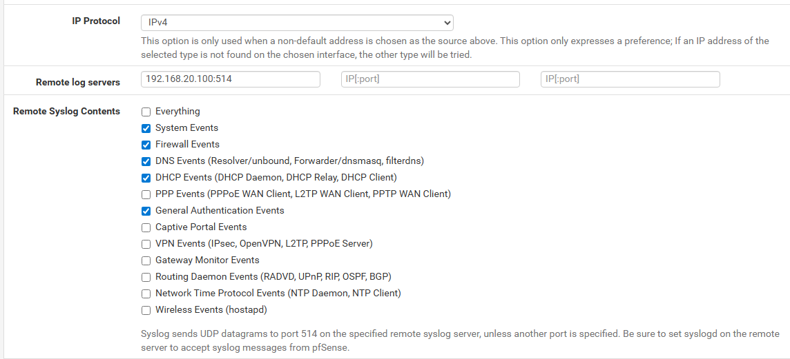

# Splunk Setup

> **Documentation In Progress**

Brief overview of the Splunk SIEM deployment and log forwarding configuration.

## Splunk Server

Splunk Enterprise is installed on the Splunk-Server (192.168.20.100) on SOC_NET. It receives logs from endpoints across all subnets on port 9997.

## Universal Forwarder Deployment

Splunk Universal Forwarders were installed on endpoints to ship logs to the Splunk server. During setup, the forwarder is pointed at the Splunk server's IP and receiving port:

- **Receiving Indexer:** 192.168.20.100
- **Port:** 9997

## pfSense Log Forwarding

pfSense was configured to forward its own syslog data to the Splunk server. Under **Status > System Logs > Settings**, remote logging was enabled with the Splunk server as the destination. Log categories including firewall events, DNS, DHCP, and system messages are forwarded.

## Firewall Rules for Log Forwarding

Each subnet has a firewall rule allowing outbound traffic to the Splunk server on port 9997:

| Source | Destination | Port | Purpose |
|---|---|---|---|
| DMZ_NET (172.16.0.200) | 192.168.20.100 | 9997 | DVWA webserver logs |
| CORP_NET subnets | 192.168.20.100 | 9997 | DC and workstation logs |

## Future To Do
- Splunk Deployment Server (maybe)
- Sysmon integration
